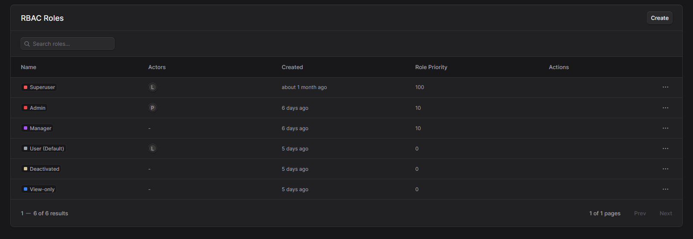
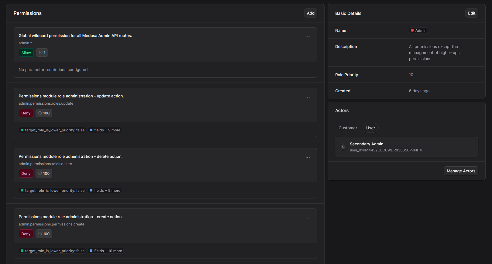
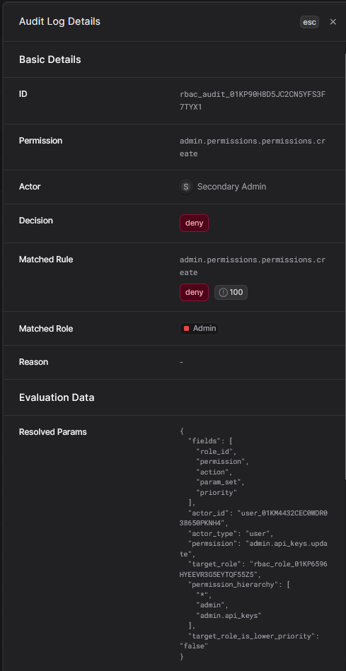

<p align="center">
  <a href="https://www.medusajs.com">
  <picture>
    <source media="(prefers-color-scheme: dark)" srcset="https://user-images.githubusercontent.com/59018053/229103275-b5e482bb-4601-46e6-8142-244f531cebdb.svg">
    <source media="(prefers-color-scheme: light)" srcset="https://user-images.githubusercontent.com/59018053/229103726-e5b529a3-9b3f-4970-8a1f-c6af37f087bf.svg">
    
  </picture>
  </a>
</p>

<h2 align="center">
  Medusa Permissions
</h2>

<h5 align="center">
  <a href="https://docs.medusajs.com">MedusaJS</a> |
  <a href="https://www.npmjs.com/package/medusa-permissions">npm</a> |
  <a href="https://github.com/medusajs/medusa-permissions">Repository</a>
</h5>


<br>

## Abstract

The Permissions module secures admin and custom module APIs with an RBAC model extended by ABAC-like context-aware parameters.
It does so by using a flexible architecture that lets developers extend authorization behavior via permission definitions, actor resolvers, context resolvers, workflow-based evaluation, and middleware enforcement with audit logging.

## Overview

The Permissions module provides authorization for admin and custom module APIs using an `RBAC + context-aware policy` model.

At its core, actors (for example, `user` or `customer`) are resolved to roles, and roles contain permission rules (`allow` / `deny`) for permission keys such as `admin.orders.list` or `admin.permissions.permissions.update`.

The module extends classic RBAC with request-context parameters, allowing rules to be scoped by runtime values (built-in parameters include `resource_id`, `sales_channel_id`, `region_id` among others). 

This enables advanced controls such as hierarchy-safe role administration, field-level query/mutation restrictions, and partial access behavior where denied fields can be filtered from query or mutation requests.

Permission decisions are evaluated through module services and workflow steps, then enforced in API middlewares. The module also records permission validation audit logs, including matched rule/role details and evaluation context, so authorization behavior is traceable and debuggable.

Permission key matching supports hierarchical wildcard candidates (for example, `admin.orders.update` -> `admin.orders.*` -> `admin.*` -> `*`) using suffix wildcards.

## Installation
```
npm i medusa-permissions
# or
yarn add medusa-permissions
```

## Configuration
Add the plugin and module definition to `medusa-config.ts`:
```ts
module.exports = {
  /* ... */
  plugins: [
    "medusa-permissions"
  ],
  /* ... */
  modules: [
    {
      resolve: "medusa-permissions/modules/permissions",
      options: {
        permissions: [
          {
            resolve: "medusa-permissions/permissions/admin"
          }
        ],
        actors: [
          {
            resolve: "medusa-permissions/actors/customer"
          },
          {
            resolve: "medusa-permissions/actors/user"
          }
        ]
      }
    }
  ]
}
```
The above snippet registers the Permissions module with a set of predefined admin permissions and two actor providers for `user` and `customer` actors. You can customize the permissions and actors as needed by providing your own definitions.

Run migrations afterwards to create the necessary database tables:
```
npx medusa db:migrate
```

### Middlewares
To enforce permissions on the base Medusa Admin API and Permission Module API routes, add the built-in middlewares to `src/api/middlewares.ts`:

```ts
import { adminApiPermissionMiddlewares } from "medusa-permissions/middlewares/permissions";

export default defineMiddlewares({
  routes: [
    ...adminApiPermissionMiddlewares,
    // ... other middlewares ...
  ]
});
```

> [!IMPORTANT]
> Please note that defining the middlewares before assigning a role to an admin user will effectively lock you out of the system, as no permissions will be granted to any user. In order to resolve this issue:
> 
> Configure the module with the actor providers and permissions, start the application, create a role allowing all permissions to an admin user, and only then add the middlewares to the project. 

In order to define custom permission middlewares for your own module APIs and understand the permission context and parameter behavior, refer to the [Advanced Usage](#advanced-usage) section below.

The built-in admin middleware stack also demonstrates global field-level controls with `admin.api.query`, `admin.api.mutate`, and `admin.api.partial`, where partially allowed field sets can be auto-filtered before route handlers execute.


## Basic Usage
In addition to the Access Control system, the plugin provides an administrative interface for management of permissions and roles. The interface is embedded within the Medusa Admin dashboard on the "Extensions" > "Permissions" page.



Create a role by using the "Create Role" button, then assign permissions to the role. For example, you can create a "Admin" role with permissions to list and manage orders, but not to manage users or permissions (for more information on Paramter Scoping, continue onto [its section below](#parameter-scoping)). After assigning the role to a user, that user will only have access to the allowed actions based on the permissions defined in the role.



*Role details view, including assigned permissions with parameter scoping and role configuration.*

### Evaluation Precendence / Rule Priority
When multiple permission rules apply to a request, the Permissions module evaluates them based on a defined order of precedence.

1. Rule Priority - Each permission rule can be assigned a priority level. Rules with higher priority will be selected over rules with lower priority when multiple candidate rules match a request.
2. Specificity - If multiple rules have the same priority, the module evaluates their specificity. More specific rules (for example, those that apply to a specific resource or context) will take precedence over more general rules.
3. Deny-first - If there are conflicting rules with the same priority and specificity, deny rules will take precedence over allow rules to ensure a secure default behavior.

Candidate matching supports wildcard fallback and evaluates candidates such as `permission.key`, `permission.*`, parent wildcards, and finally `*`.

### Role Priority
Role priority defines a hierarchy among roles, useful for scenarios like role management where you want to ensure that users can only manage roles that are below their own in the hierarchy. A role with a higher priority value is considered "higher" in the hierarchy than a role with a lower priority value.

The priority does not provide any implicit permissions or access control behavior on its own. Instead, it can be used in conjunction with permission rules and parameters to create conditional access controls. Continue onto the Parameter Scoping section below for an example of how role priority can be used in a permission rule.

In built-in admin role and rule routes, middleware computes hierarchy context (`target_role`, `target_role_is_lower_priority`, actor top priority, target priority) to support safe "manage only lower-priority roles" policies.

### Parameter Scoping (ABAC-like behavior)<a id="parameter-scoping"></a>
The Permissions module supports parameter scoping, which allows you to define permissions that are conditional based on runtime parameters. For example, you can create a permission that allows a user to manage orders only if they belong to a specific sales channel.

To define a policy with parameter scoping, you can use the "Parameters" section when creating or editing a policy. Here, you can specify the parameters that should be evaluated when determining if the permission applies to a given request. 

For example, a "admin.permissions.roles.update" permission could be scoped with a `target_role_is_lower_priority` parameter, which checks if the role being updated has a lower priority than the user's highest role. This ensures that users can only manage roles that are below their own in the hierarchy.


- Resource and tenancy scoping: `resource_id`, `store_id`, `sales_channel_id`, `region_id`, `stock_location_id`, `customer_group_id`
- Actor scoping: `actor_id`, `actor_type`
- Field and route scoping: `fields`, `route`
- Permission hierarchy scoping: `permission`, `permission_hierarchy`
- Role hierarchy scoping: `target_role`, `target_role_is_lower_priority`

You can populate these with layered `createPermissionContextMiddleware(...)` calls that merge route params, validated body/query values, and async lookups.

### Audit Logs
Audit Logs capture each permission evaluation and are useful for explaining why a request was allowed or denied.

In the admin UI, open "Extensions" > "Permissions" > "Audit Logs" to review recent decisions, filter by actor/permission/outcome, and inspect per-entry details such as matched rule, matched role, resolved parameters, and evaluation reason.



*Audit log details drawer with actor, decision, matched rule/role, and resolved context information.*

Audit logs are **enabled** by default. To disable audit logging, set `enable_audit_logs` to `false` in the module options:

```ts
{
  resolve: "medusa-permissions/modules/permissions",
  options: {
    enable_audit_logs: false,
    // ... other options ...
  }
}
```

## Advanced Usage
The Permissions module is designed to be highly extensible, allowing you to customize various aspects of the access control. Below are some examples of advanced usage scenarios:

### Actor Providers
Actor providers are responsible for resolving actors (such as users or customers) to their associated roles and permissions. You can create custom actor providers to integrate with your existing user management system or to support additional actor types. For example, you could create an actor provider for a "vendor" actor type that resolves vendor users to their roles and permissions.


```ts
export abstract class AbstractActorResolver {
    static identifier: string;
    static display_name: string;
    static actor_type: string;

    constructor(
        public readonly actor_type: string,
        protected readonly container: MedusaContainer["cradle"],
        protected readonly options: Record<string, any>
    ) { }

    abstract getActorDetails(input: ActorResolverInput): Promise<ActorResolverDetailsOutput>;
    abstract listRoles(input: ActorResolverInput): Promise<ActorResolverOutput>;
    abstract listActors(input: ActorResolverListInput): Promise<ActorResolverListOutput[]>;
    abstract updateActorRoles(input: ActorResolverUpdateRolesInput): Promise<ActorResolverOutput>;
}
```

### Permission Definitions
Permission definitions allow you to define custom permissions and their associated rules. You can create permission definitions for your custom module APIs or to extend the base Medusa Admin API permissions. For example, you could create a permission definition for a "vendor.orders.manage" permission that allows vendor users to manage their own orders.

Export the definitions within an array or an object as follows:

```ts
import { definePermission } from "medusa-permissions/modules/permissions/definitions"

export default [
  definePermission({
    key: "vendor.orders.manage",
    description: "Manage Orders",
    params: [],
  }),
]
```

### Parameters
Parameters are used to define dynamic conditions for permission rules. You can create custom parameters to evaluate specific conditions based on the request context. For example, you could create a parameter that checks if the user is the owner of a resource before allowing access.

Using the previous example, we can now extend it with a custom parameter `is_order_owner` that checks if the user is the owner of the order they are trying to manage. The permission definition would look like this:

```ts
const isOwnerParam: PermissionParamDefinition = {
    name: "is_owner",
    resolver: resolveContextValue("is_owner"), // Get the value from req.permissionContext (set by a middleware)
}

export default [
  definePermission({
    key: "vendor.orders.manage",
    description: "Manage Orders",
    params: [isOwnerParam],
  }),
]
```

When combined with a Permission Rule that has a condition on the `is_owner` parameter, this setup allows you to implement an ABAC-like behavior where users can only manage orders that they own.

### Middlewares
This package provides middleware utilities for enforcing permissions and populating the permission context.

```ts
import { defineMiddlewares } from "@medusajs/framework/http";
import {
  createPermissionContextMiddleware,
  validatePermission,
  validateAnyPermission,
  validateAllPermissions,
} from "medusa-permissions/utils/permission-middleware";

const withOwnerContext = createPermissionContextMiddleware((req) => ({
  resource_id: req.params?.id,
  is_owner: true,
}))

export default defineMiddlewares({
  routes: [
    {
      method: "GET",
      matcher: "/admin/vendor_orders/:id",
      middlewares: [
        withOwnerContext,
        validatePermission("vendor.orders.manage")
      ]
    },
  ]
});
```

For admin API parity, you can also apply route-scoped global field controls with built-in helpers such as `withGlobalQueryPermission(...)` and `withGlobalMutatePermission(...)`. These middlewares use `admin.api.query`, `admin.api.mutate`. Additionally, using `admin.api.partial` allows you to define field-level permissions where denied fields are automatically filtered from the request.

## Built-in extensions
The Permissions module comes with several built-in extensions that provide common functionality out of the box. These include:

- Predefined admin permissions covering various aspects of the Medusa Admin API. (``medusa-permissions/permissions/admin``)
- Actor providers for `user` and `customer` actor types that resolve roles and permissions based on the Medusa User and Customer models. (``medusa-permissions/actors/user``, ``medusa-permissions/actors/customer``)
- Middlewares for enforcing permissions on the base Medusa Admin API and Permission Module API routes. (``medusa-permissions/middlewares/permissions``)
- Dedicated administrative interface for managing permissions and roles within the Medusa Admin dashboard.
- Validation audit logs and API endpoints to inspect permission decisions and debugging metadata.

You can extend existing built-in keys by re-registering the same permission key with additional params, which merges parameter definitions instead of forcing a full fork of the original permission registry.

## Contributing
Contributions are welcome! If you have an idea for a new feature, improvement, or bug fix, please open an issue or submit a pull request.

## License
MIT